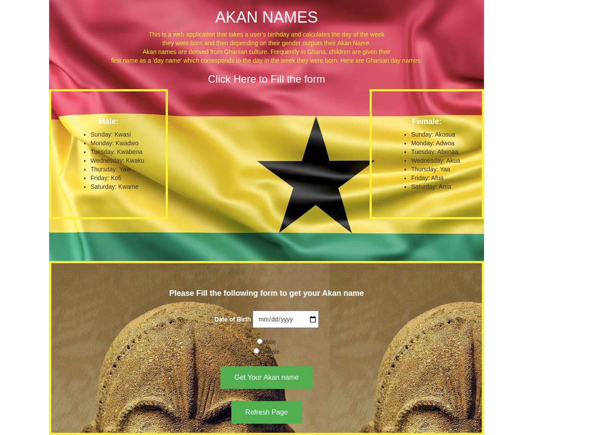

# Week2Project

### Author
##### Belyse Uwambayinema

**The above is a web application that takes a user's birthday and calculates the day of the week they were born and then depending on their gender outputs their Akan Name.**

*Akan names are derived from Ghanian culture. Frequently in Ghana, children are given their first name as a 'day name' which corresponds to the day in the week they were born. Here are Ghanian day names.*

This is the live link to my project : https://ubelyse.github.io/week2project/